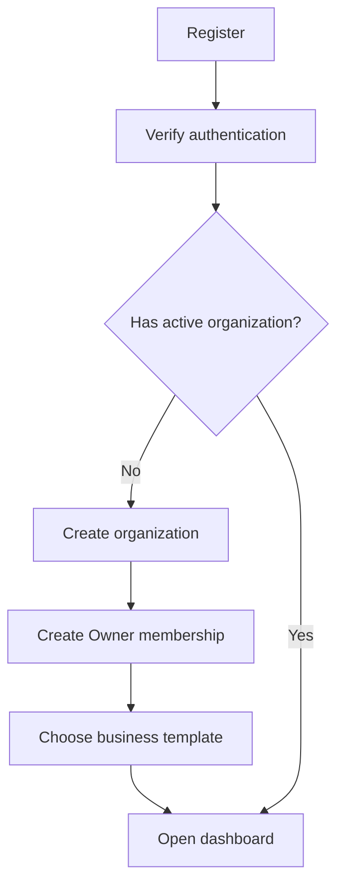
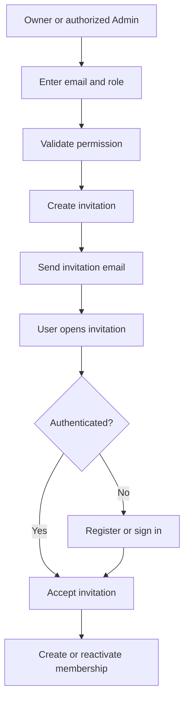
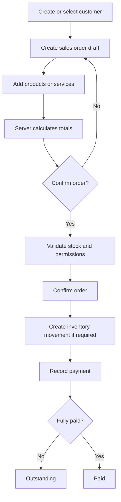
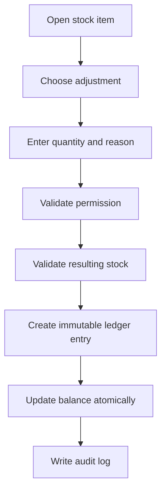
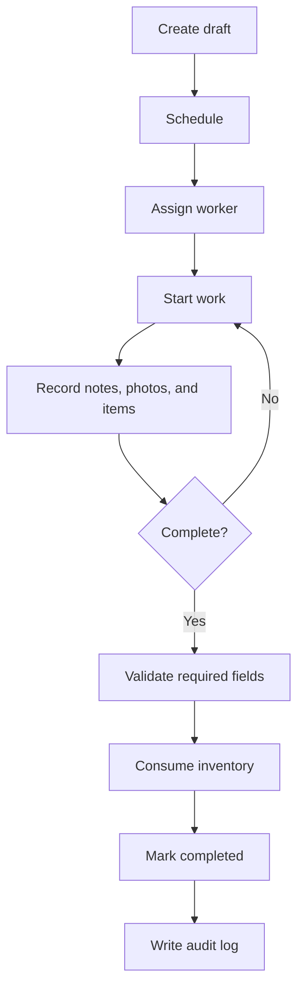

# Business Workflows

## 1. Organization Onboarding



## 2. Invite Member



## 3. Customer to Sale



## 4. Inventory Adjustment



## 5. Work Order Lifecycle



## 6. Work Order Item Usage

```text
Select work order
→ Select warehouse
→ Select tracked item
→ Enter quantity
→ Validate available stock
→ Create work order item snapshot
→ Create inventory transaction
→ Update stock balance
→ Commit atomically
```

## 7. Payment Recording

```text
Open order
→ Enter payment details
→ Validate amount
→ Create payment record
→ Recalculate outstanding amount
→ Update payment status
→ Write audit log
```

## 8. Cancellation

Cancellation must never behave like deletion.

```text
Request cancellation
→ Check permission
→ Check current status
→ Determine inventory reversal
→ Determine payment impact
→ Require reason
→ Apply reversal transaction
→ Mark cancelled
→ Write audit log
```

## 9. Tenant Switching

```text
Authenticated user
→ Load active memberships
→ Select organization
→ Store active organization safely
→ Revalidate membership on each server request
→ Load organization-scoped data
```

The selected organization identifier is a user preference, not proof of authorization.
